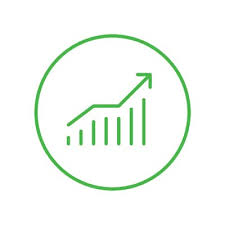

# Portfolio Optimizer

A sophisticated financial analytics platform that combines advanced portfolio visualization with interactive market data insights, designed to empower individual investors with comprehensive and user-friendly financial tracking tools.

## Table of Contents
- [Getting Started](#getting-started)
- [Creating Your Portfolio](#creating-your-portfolio)
- [Portfolio Analysis](#portfolio-analysis)
- [Efficient Frontier Tool](#efficient-frontier-tool)
- [Managing Saved Portfolios](#managing-saved-portfolios)
- [Market Data](#market-data)
- [Technical Details](#technical-details)

## Getting Started

### Registration and Login
1. Visit the homepage of Portfolio Optimizer
2. Click on **Sign Up** in the navigation menu
3. Complete the registration form with your username, email, and password
4. After registration, you'll be automatically logged in
5. For returning users, click **Login** and enter your credentials

## Creating Your Portfolio

### Manual Entry
1. Navigate to **My Models** > **Create New Portfolio**
2. Enter asset details one by one:
   - Ticker symbol (e.g., AAPL, SPY)
   - Asset type (Stock, ETF, Bond, Crypto)
   - Quantity or shares owned
   - Purchase price (optional)
   - Purchase date (optional)
3. Click **Add Asset** to include it in your portfolio
4. Continue adding all your assets
5. Click **Save Portfolio** when finished
6. Provide a name for your portfolio when prompted

### CSV Upload
1. Navigate to **My Models** > **Create New Portfolio**
2. Click the **Upload CSV** tab
3. Prepare your CSV file with columns for:
   - Ticker (required)
   - Type (optional, defaults to Stock)
   - Quantity (required)
   - Purchase Price (optional)
   - Purchase Date (optional)
4. Upload your file and follow the instructions to import your portfolio
5. Review the imported assets and click **Save Portfolio**

## Portfolio Analysis

### Viewing Portfolio Metrics
1. Go to **My Models** > **My Saved Portfolios**
2. Select a portfolio from your list to view
3. The dashboard displays:
   - Current value and allocation
   - Performance metrics (CAGR, standard deviation, Sharpe ratio, etc.)
   - Interactive charts showing:
     - Portfolio growth over time
     - Asset allocation
     - Annual returns
     - Drawdowns
     - Monthly returns heatmap
     - Rolling returns

### Refreshing Market Data
1. While viewing your portfolio, click the **Refresh Market Data** button
2. This fetches the most current price data from financial APIs
3. All metrics and charts will update automatically with fresh data

## Efficient Frontier Tool

### Optimizing Asset Allocation
1. Navigate to **Tools** > **Efficient Frontier**
2. Enter ticker symbols for the assets you want to analyze (e.g., SPY, QQQ, GLD)
3. Select a date range for historical analysis
4. Click **Calculate** to generate the efficient frontier
5. The results will show:
   - Interactive efficient frontier chart
   - Tangency portfolio (maximum Sharpe ratio)
   - Maximum information ratio portfolio
   - Equal-weight portfolio for comparison
   - Risk/return metrics for each asset
   - Optimal portfolio weights for different risk levels
   - Transition map showing how allocations change along the frontier

## Managing Saved Portfolios

### Viewing Saved Portfolios
1. Go to **My Models** > **My Saved Portfolios**
2. See a list of all your saved portfolios with creation dates

### Editing a Portfolio
1. In the saved portfolios list, click **Edit** next to the portfolio you want to modify
2. Add, remove, or adjust assets as needed
3. Click **Save Changes** when finished

### Deleting a Portfolio
1. In the saved portfolios list, click **Delete** next to the portfolio you want to remove
2. Confirm deletion when prompted

### Downloading Portfolio Data
1. While viewing a portfolio, click **Download Portfolio**
2. Select your preferred format (CSV or JSON)
3. The file will download, containing all portfolio data and metrics

## Market Data

The application automatically fetches and maintains current market data for all assets in your portfolios through multiple financial APIs:

- **Yahoo Finance**: Stock, ETF price data
- **Alpha Vantage**: Additional stock data and bond yields
- **FRED**: Economic indicators
- **CoinGecko**: Cryptocurrency prices

Data is refreshed automatically in the background, but you can also manually trigger updates with the **Refresh Market Data** button.

## Technical Details

The Portfolio Optimizer is built with a modern technology stack:

- Flask web framework with SQLAlchemy for database management
- Advanced financial calculations including Modern Portfolio Theory algorithms
- Interactive visualizations powered by Plotly
- Multi-source market data integration
- Responsive design for both desktop and mobile use

---

© 2025 Portfolio Optimizer | All Rights Reserved